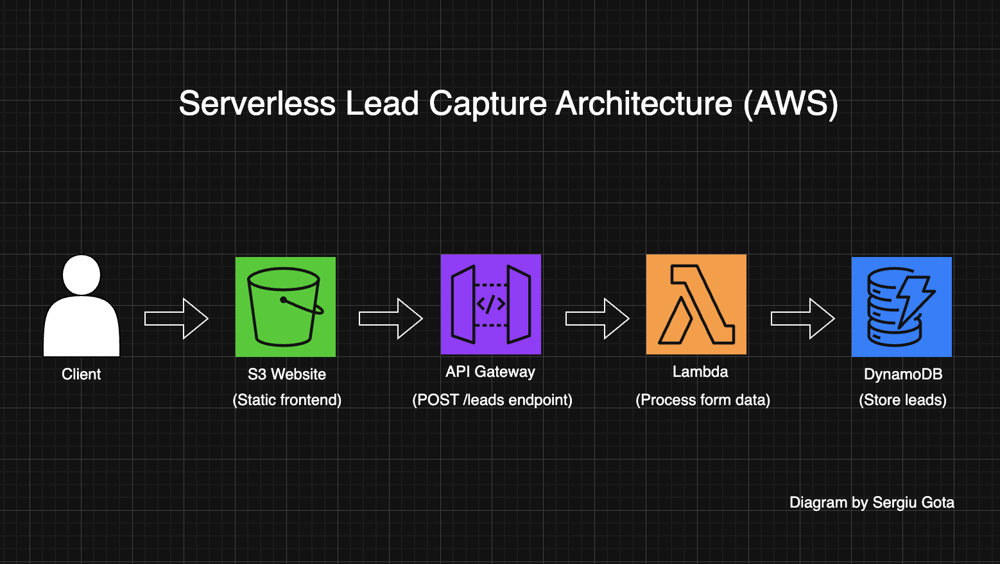
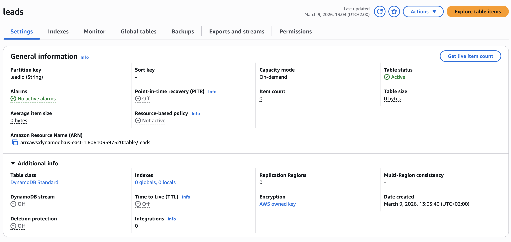
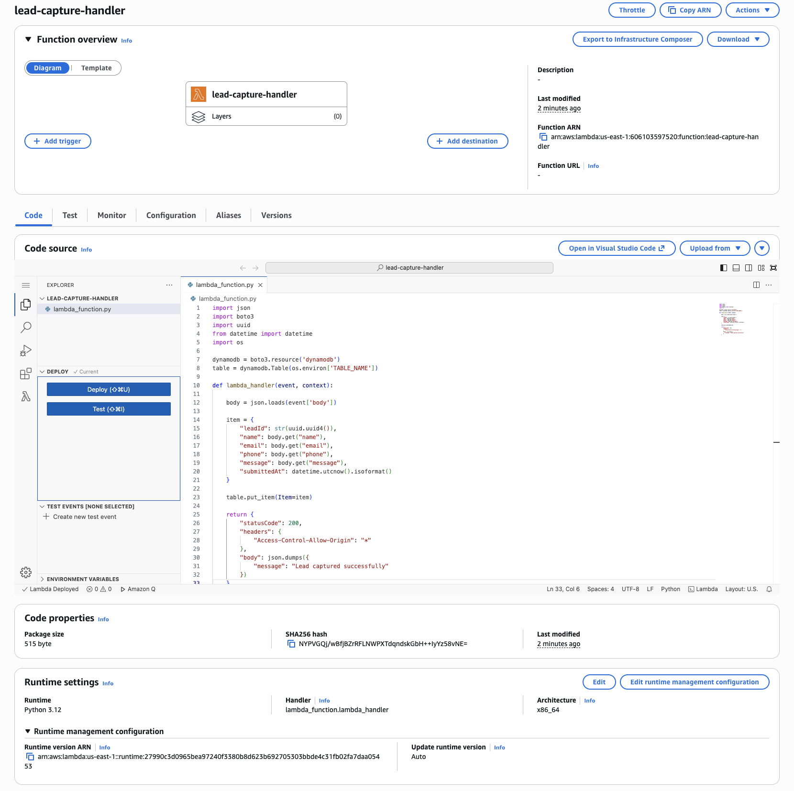
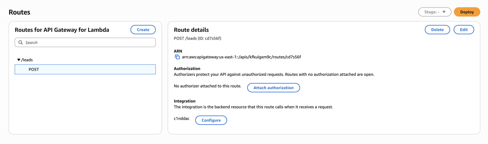
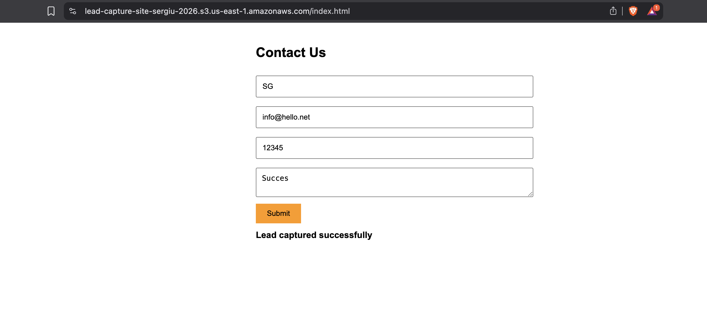
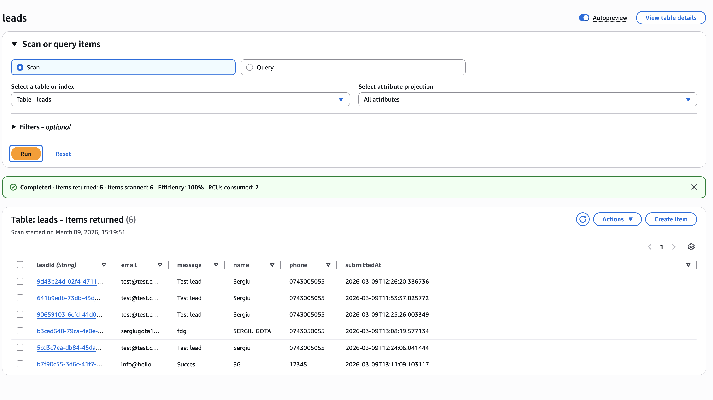

# AWS Serverless Lead Capture Application

## Overview

This project demonstrates a serverless lead capture application built using AWS services.

Users submit a contact form from a static website hosted on Amazon S3.
The request is sent to Amazon API Gateway, processed by an AWS Lambda function written in Python, and stored in Amazon DynamoDB.

---

## Infrastructure Architecture

The diagram below shows the serverless infrastructure used in this project.



Architecture flow:

```
User
  ↓
S3 Website
  ↓
POST /leads
  ↓
API Gateway
  ↓
Lambda
  ↓
DynamoDB
```

---

## AWS Services Used

Amazon S3 – Static website hosting  
Amazon API Gateway – HTTP API endpoint  
AWS Lambda – Backend processing logic  
Amazon DynamoDB – NoSQL database for storing leads  

---

## Application Flow

1. User accesses the static website hosted on Amazon S3
2. The user submits the contact form
3. The frontend sends a POST /leads request to API Gateway
4. API Gateway triggers the Lambda function
5. Lambda processes the form data
6. The lead information is stored in DynamoDB

---

## Screenshots

### DynamoDB Table Configuration



### Lambda Function



### API Gateway Route



### Frontend Form Submission



### Stored Leads in DynamoDB



---

## Project Structure

```
aws-serverless-lead-capture/
│
├── README.md
│
└── screenshots/
    ├── 01-dynamodb-table.png
    ├── 02-lambda-function.png
    ├── 03-api-gateway-route.png
    ├── 04-frontend-form-submission.png
    ├── 05-dynamodb-leads-data.png
    └── 06-architecture-diagram.png
```

---

## Author

Sergiu Gota  
AWS Cloud Engineering Portfolio Project
